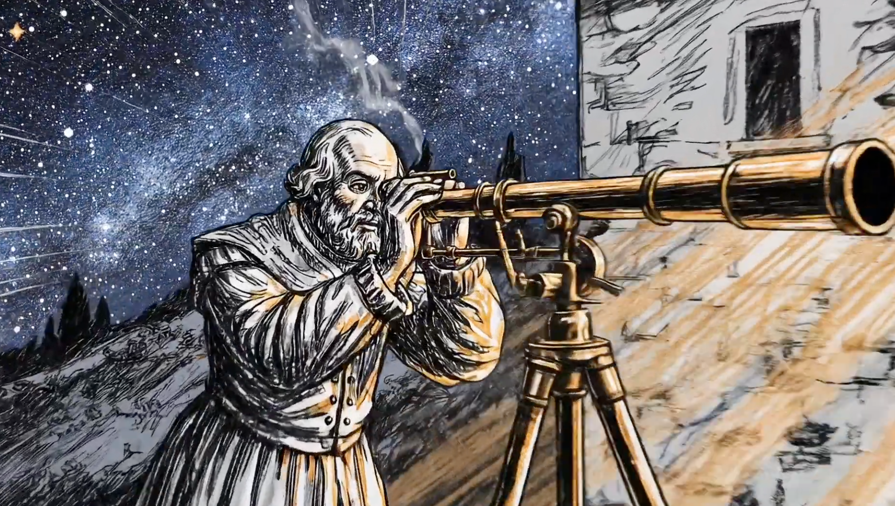

# Vibe Filmmaking with Claude Code & Veo 3

> **Collaborative AI filmmaking: Claude Code + Google Veo 3.1**

[](https://www.youtube.com/watch?v=-w64vfYWlJI)

### [🎬 Watch the Final Video (1:17)](https://www.youtube.com/watch?v=-w64vfYWlJI)

An open record of creating Orchestra's "Galileo" launch video through **iterative AI collaboration**. All prompts co-created with Claude Code, all videos generated with Google Veo 3.1, final edit made in CapCut. This is vibe-driven filmmaking - where creative vision evolves through conversation with AI.

**✨ Final Result:** 1 minute 17 seconds of manifesto storytelling that travels from 1610 (Galileo's wonder) to 2025 (infrastructure hell) to the future (science returned to the curious) - all in pencil sketch animation.

---

## ✨ What Makes This Different

This isn't just AI video generation. This is **vibe filmmaking** - creative collaboration between human vision and AI capabilities:

- **Claude Code wrote all prompts** through iterative conversation
- **5 major creative pivots** from photorealism → pencil sketch art
- **6 animation styles tested** systematically to find the right aesthetic
- **26 video clips generated** exploring different approaches
- **Complete evolution preserved** - see every decision, every iteration

**The result:** Not a tech demo. An artistic manifesto that feels *human* despite being AI-generated.

---

## 🎨 The Vibe Journey

### Act I: Finding The Aesthetic (V1-V4)

Started photorealistic. Too literal. Not manifesto material.

**Claude Code iterated:**
- **V1:** Detailed, technical prompts → too prescriptive
- **V2:** Simplified Apple-style → better mood, still too real
- **V3:** Balanced approach → good, but missing something
- **V4:** **Breakthrough** - tested 6 animated styles:
  - Watercolor, pencil sketch, vector, ink wash, 3D, paper cut-out
  - **Pencil sketch won** - humanistic, hand-crafted, authentic

### Act II: Adding Motion & Emotion (V5)

Final iteration with Claude Code:
- Camera movements that breathe
- Character actions that land emotionally
- Match cuts that show transformation
- **The eureka:** Galileo sketching his discovery → modern researcher filling forms
  - Same hand gesture, opposite meaning
  - Joyful discovery → bureaucratic drudgery
  - Devastating contrast

**Final aesthetic:** Pencil sketch animation - artistic, expressive, feels handmade despite being AI.

---

## 🎬 What Got Created

### The Scenes

1. **Galileo's Wonder** - Looking through telescope, cosmic awe
2. **Eureka Moment** - Sees Jupiter's moons, sketches with joy
3. **Match Cut** - Sketching hand → form-filling hand (bureaucracy)
4. **Infrastructure Hell** - Terminal errors, GPU queues, paper mountains
5. **Breaking Point** - Defeat, darkness, silence
6. **Light Returns** - Warm laptop glow, hope emerges
7. **Collective Awakening** - Constellation of curious people

**26 clips total** - tests, experiments, final production

### The Evolution

| Version | Vibe | Claude Code's Insight |
|---------|------|----------------------|
| V1 | Photorealistic documentary | Too literal - not artistic enough |
| V2 | Cinematic Apple ad | Better mood, but still realistic |
| V3 | Balanced approach | Good flow, missing manifesto energy |
| V4 | **Style breakthrough** | Animation > photorealism for manifestos |
| V5 ✅ | Pencil sketch poetry | **Perfect** - humanistic, artistic, authentic |

---

## 🤖 Claude Code's Role

**All prompts co-created through conversation:**

- Analyzed the creative brief
- Suggested prompt structures (Subject → Action → Style → Camera → Ambiance)
- Iterated on aesthetic approaches
- Proposed the animated style pivot
- Refined emotional beats and camera movements
- Generated production scripts

**Example conversation:**
> "The photorealism feels too literal for a manifesto. What if we tried animated styles? Pencil sketch could feel more human, more hand-crafted..."

This is **vibe filmmaking** - where AI isn't just executing commands, but collaborating on creative direction.

---

## 🚀 Try It Yourself

### Quick Start

```bash
# Setup
cd scripts/core
pip install -r requirements.txt
cp .env.example .env
# Add your GOOGLE_API_KEY from https://ai.google.dev/

# Generate your first vibe
python
>>> from generate_videos import VeoVideoGenerator
>>> gen = VeoVideoGenerator(api_key="your-key")
>>>
>>> # Use Claude Code to help write your prompt!
>>> gen.generate_clip(
...     clip_id="my_vibe",
...     prompt="""
...     Subject: Person looking up at stars with wonder
...     Action: Slowly tilting head back, expression of awe
...     Style: Pencil sketch animation, hand-drawn gestural lines
...     Camera: Slow dolly in from wide to close-up
...     Ambiance: Warm golden light, intimate atmosphere
...     Audio: Soft wind, distant music, breath of wonder
...     """,
...     duration=8,
...     resolution="1080p"
... )

# Download your video
python download_videos.py
```

### With Claude Code

1. **Describe your vibe** - What emotion? What story?
2. **Let Claude Code help** - Iterate on prompts together
3. **Test & refine** - Generate, review, adjust
4. **Evolve the aesthetic** - Try different styles
5. **Create** - Build your vision clip by clip

---

## 📚 Explore The Process

### For Vibe Filmmakers

- **[EVOLUTION.md](docs/EVOLUTION.md)** - Complete creative journey & learnings
- **[prompts/v1-v5/](prompts/)** - See how prompts evolved
- **[scripts/experiments/](scripts/experiments/)** - Style testing process

### For Technical Implementation

- **[USAGE.md](docs/USAGE.md)** - Complete usage guide
- **[scripts/core/](scripts/core/)** - Reusable generation engine
- **[QUICKSTART.md](QUICKSTART.md)** - 3-step quick start

### For Creative Direction

- **[video-concept-and-script.md](docs/creative/video-concept-and-script.md)** - Original creative brief
- **[prompts/v5-final-pencil/](prompts/v5-final-pencil/)** - Final production prompts

---

## 💡 Key Insights from Claude Code Collaboration

### Creative Learnings

1. **Animation > Photorealism** for emotional/manifesto content
2. **Pencil sketch = humanity** in AI-generated art
3. **Less prescriptive prompts** = better artistic interpretation
4. **Match cuts are powerful** - same gesture, opposite meaning
5. **Iteration is everything** - V1 → V5 made all the difference

### Technical Learnings

1. **1080p = 8s duration only** (Veo constraint)
2. **Extensions need same resolution** as parent
3. **Rate limiting matters** - 60s between requests
4. **Test styles systematically** - don't assume first approach is best
5. **Claude Code accelerates** the creative process dramatically

---

## 🎯 Repository Structure

```
├── 📄 README.md                       # You are here
├── 📄 QUICKSTART.md                   # 3-step quick start
│
├── 📁 docs/
│   ├── 📄 EVOLUTION.md                # Complete creative journey ⭐
│   ├── 📄 USAGE.md                    # Technical usage guide
│   ├── 📁 creative/                   # Creative briefs
│   └── 📁 technical/                  # API docs
│
├── 📁 prompts/                        # The evolution ⭐
│   ├── v1-initial/                    # First attempts
│   ├── v2-cinematic/                  # Apple-style
│   ├── v3-refined/                    # Balanced
│   ├── v4-animated/                   # Style breakthrough
│   └── v5-final-pencil/ ✅            # Final production
│
├── 📁 scripts/
│   ├── 📁 core/                       # Reusable engine
│   ├── 📁 experiments/                # Style testing ⭐
│   └── 📁 production/                 # Scene generators
│
└── 📁 output/                         # 26 generated clips
```

⭐ = Most interesting for learning vibe filmmaking

---

## 🎨 What You Can Create

**This isn't just for launch videos.** Use Claude Code + Veo 3.1 for:

- **Manifesto videos** - Artistic statements
- **Product storytelling** - Emotional not functional
- **Abstract narratives** - Vibes over explanations
- **Experimental films** - Try styles, iterate fast
- **Music videos** - Visual poetry
- **Creative explorations** - See what emerges

**The workflow:**
1. **Vibe with Claude Code** - Describe the feeling you want
2. **Iterate prompts** - Let Claude Code help structure
3. **Test styles** - Generate variations quickly
4. **Evolve** - Follow what works
5. **Create** - Build your vision

---

## 🛠 Tech Stack

- **Creative Partner:** Claude Code (prompt iteration & creative direction)
- **Video Generation:** Google Veo 3.1 (`veo-3.1-generate-preview`)
- **Final Edit:** CapCut (assembling clips, text overlays, timing)
- **Scripts:** Python 3.8+ with `google-generativeai`
- **Workflow:** Iterative collaboration (human vision + AI capabilities)

---

## 📊 Project Stats

- **5 creative iterations** evolved over 2 days
- **6 animation styles** tested systematically
- **26 video clips** generated (tests + production)
- **~850MB** of raw footage
- **100% prompt collaboration** with Claude Code
- **1:17** final video duration (edited in CapCut)

---

## 🌟 Why This Matters

Most AI video demos show you the **output**. This shows the **creative process**:

- How do you find the right aesthetic? (V1 → V5)
- How do you work with AI creatively? (Claude Code collaboration)
- What's possible with vibe-driven filmmaking? (See the results)
- How do creative decisions get made? (Full evolution documented)

**This is the future of filmmaking** - not replacing human creativity, but amplifying it through AI collaboration.

---

## 🎬 The Vibe Filmmaking Workflow

```
1. Human Vision
   ↓
2. Claude Code Collaboration (prompt iteration)
   ↓
3. Veo 3.1 Generation (video creation)
   ↓
4. Human Curation (what works?)
   ↓
5. Iterate (refine, pivot, evolve)
   ↓
6. Final Production
```

**Speed:** Days not months
**Cost:** API credits not studio budgets
**Quality:** Artistic not corporate
**Process:** Collaborative not directive

---

## 🚧 Requirements

- Python 3.8+
- Google AI API key (Veo 3.1 access)
- Claude Code (for prompt collaboration)
- Creative vision + willingness to iterate

```bash
pip install -r scripts/core/requirements.txt
```

---

## 📖 Start Here

**Want to vibe filmmaking?**
1. Read this README
2. Check [EVOLUTION.md](docs/EVOLUTION.md) for the creative journey
3. Try [QUICKSTART.md](QUICKSTART.md)
4. Use Claude Code to iterate on your prompts!

**Want to understand the tech?**
1. [USAGE.md](docs/USAGE.md) - Complete guide
2. [scripts/core/](scripts/core/) - Reusable code
3. [prompts/v5-final-pencil/](prompts/v5-final-pencil/) - Production prompts

**Want to learn the process?**
1. [docs/EVOLUTION.md](docs/EVOLUTION.md) - Full story
2. [prompts/](prompts/) - Browse v1 → v5
3. [scripts/experiments/](scripts/experiments/) - See style testing

---

## 🙏 Credits

- **Creative Vision:** Orchestra team
- **Prompt Collaboration:** Claude Code (Anthropic)
- **Video Generation:** Veo 3.1 (Google)
- **Vibe:** The intersection of human creativity + AI capabilities

---

## 🔗 Links

- **Orchestra:** [orchestra.art](https://orchestra.art) *(update with real URL)*
- **Veo 3.1 API:** https://ai.google.dev/models/veo
- **Claude Code:** https://claude.com/claude-code
- **Get Started:** https://ai.google.dev/

---

## ✉️ Questions?

**Creative process:** See [docs/EVOLUTION.md](docs/EVOLUTION.md)
**Using the code:** See [docs/USAGE.md](docs/USAGE.md)
**Prompts:** Browse [prompts/v5-final-pencil/](prompts/v5-final-pencil/)
**Vibe filmmaking:** Start with [QUICKSTART.md](QUICKSTART.md) + Claude Code

---

**"This is how films get made now."** 🎬

*Vibe filmmaking: where creative vision meets AI collaboration.*
